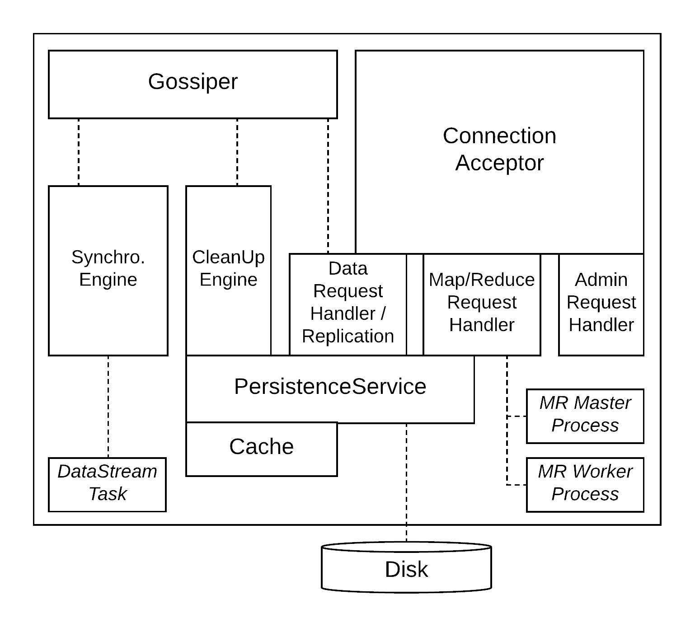

# Architecture

This database is a distributed key,value-store.
This implementation uses _sharding_ to distribute data amongst nodes and
_replication_ to avoid data loss in case of failures.

Within the CAP-triangle,
we are currently approaching the A(vailability).

## Server Architecture



The server conceptually comprises following components:

* Connection Acceptor: Accepts connections from clients, admins or other servers.
* Data Request Handler: Handles data requests (PUT, GET, DELETE) from other clients or servers.
  This component knows of the current cluster composition and takes care of replicating and rejection requests
  based on the current responsibilities of the node.
* Admin Request Handler: Handles admin requests like start, stop, shut down.
* Persistence Service: Takes care of physically storing values. Also contains
  a configurable caching layer that reduces disk access for read operations.
* Gossiper: Continuously communicates a node's local view of the cluster state
  to other nodes and merges it with their responses. This allows the nodes
  to converge to a common understanding of the cluster without the need
  for a central configuration service.
* Synchronizer: When nodes are added or removed from the cluster, the responsibility
  of some other nodes change. The Synchronizer is triggered in such events to
  initiate the process of transferring missing data to the local node.
* Clean Up Worker: When nodes are added to the cluster, some nodes loose the
  responsibility for a part of the data they currently store. The CleanUp Worker
  checks in certain intervals if a node lost responsibility for some of the
  data and cleans it up accordingly.
  
### Intra-Server Coordination

The servers employ as Gossip mechanism inspired by Apache Cassandra in order
to coordinate about the current state of the cluster while reducing the dependency
on a central configuration service as much as possible. This makes it easier to
scale the cluster horizontally and does not make the configuration service a
single point of failure.

A Gossip exchange comprises one request-response cycle: Node A sends a Gossip
message to node B (actually to several nodes) containing its current view of the cluster
state. Upon receiving, node B merges this information with its own information
and replies with its updated state. Node A then merges node B's information
with its own information.

For each server in the cluster, a Gossip message contains the following information:

* Address: Address the node is bound to
* Generation: Server-local timestamp of when it was started
* Heartbeat: Number that is increased on the server before he starts a Gossip round
* State: One of: STOPPED, OK, JOINING, REBALANCING, DECOMMISSIONED
* StateVersion: Incremented whenever the state changes.
  It is incremented by the node for which the state changes, with the
  exception of decommissioning where it is incremented by the failure detector.
  
During the merging process, there are potentially 2 different states for one
node and only the more recent should be kept. Recency of a state is determined
by comparing the following attributes in order:

1. Generation: If the generation timestamp is newer, the corresponding node has been
   restarted and all other information is stale
2. State Version: The state version could have been changed by an external failure
   detector, so it is compared next
3. Heartbeat: If the other values are equal, the one with the largest heartbeat
   is kept.
   
#### Cluster Start

When the cluster is started for the first time, the external configuration service (ECS)
starts the server processes in parallel. They are initially in `STOPPED` state.

The cluster has to be started initially by the ECS start command. This will start the
nodes with a special mode that skips all data reallocations so that the initial nodes
do not do unnecessary work until they found each other.

Finally all the nodes should be in `OK` state.

Example:

```
ECS Client> init 5 100 FIFO
```

The server logs then will contain such logs as below at some point:
```
┌2018-12-16 21:31:30,067 [INFO] [app_kvServer.KVServer] - Cluster changed: [ClusterState:                                      │
│localhost/127.0.0.1:10000 (STOPPED): Gen.: 1544992286896, Hbeat: 3163, Sver: 1                                                │
│localhost/127.0.0.1:10001 (STOPPED): Gen.: 1544992286899, Hbeat: 3112, Sver: 1                                                │
│localhost/127.0.0.1:10002 (STOPPED): Gen.: 1544992286901, Hbeat: 3125, Sver: 1                                                │
│localhost/127.0.0.1:10003 (STOPPED): Gen.: 1544992288671, Hbeat: 1087, Sver: 1                                                │
│localhost/127.0.0.1:10004 (STOPPED): Gen.: 1544992288684, Hbeat: 1093, Sver: 1                                                │
└] [{client=/127.0.0.1:57639, correlation=3163, serverPort=10002}]
```

Next we start the cluster:
```
ECS Client> start
```

And the updated state should start to reflect in the logs:
```
┌2018-12-16 21:34:14,018 [INFO] [app_kvServer.KVServer] - Cluster changed: [ClusterState:                                      │
│localhost/127.0.0.1:10000 (OK): Gen.: 1544992286896, Hbeat: 165168, Sver: 2                                                   │
│localhost/127.0.0.1:10001 (OK): Gen.: 1544992286899, Hbeat: 167117, Sver: 2                                                   │
│localhost/127.0.0.1:10002 (OK): Gen.: 1544992286901, Hbeat: 165129, Sver: 2                                                   │
│localhost/127.0.0.1:10003 (OK): Gen.: 1544992288671, Hbeat: 165088, Sver: 2                                                   │
│localhost/127.0.0.1:10004 (OK): Gen.: 1544992288684, Hbeat: 165251, Sver: 2                                                   │
└] [{client=/127.0.0.1:58410, correlation=167117, serverPort=10003}]
```
   
#### Node Join

When a node is joined into the cluster, the corresponding server process is started
(usually by the ECS). During start, a list of initial
nodes is provided for the new node to start gossiping with. The initial state is
`STOPPED`. The joining process proceeds as follows:

1. The new node receives a `start` command (done automatically during ECS `addNode`).
2. The new node changes its state to `JOINING`. This state is gossiped throughout the cluster,
   but other nodes do not change yet.
3. As soon the new node changes its state to `JOINING` and received the current cluster state
   by some other nodes, the synchronizer starts initiating transfers of the data ranges the
   new node will be responsible for. The transferring nodes will lock the corresponding
   key ranges for writing during that time so that the chance for data inconsistencies is minimized.
4. When the data transfers have finished, the node changes its state from `JOINING` to `OK`.
5. When the other nodes receive the state update, they
   * Switch their replication targets accordingly
   * Start including the new node into cluster updates they send out to clients
   
Example:

Add two more nodes:
```
ECS Client> addNode 100 FIFO
ECS Client> addNode 100 FIFO
```

They show up in the logs first as `JOINING` and then at some point as `OK`:
```
┌2018-12-16 21:51:01,611 [INFO] [app_kvServer.KVServer] - Cluster changed: [ClusterState:                                      │
│localhost/127.0.0.1:10000 (OK): Gen.: 1544993220456, Hbeat: 241152, Sver: 2                                                   │
│localhost/127.0.0.1:10001 (OK): Gen.: 1544993220455, Hbeat: 239151, Sver: 2                                                   │
│localhost/127.0.0.1:10002 (OK): Gen.: 1544993220471, Hbeat: 241137, Sver: 2                                                   │
│localhost/127.0.0.1:10003 (OK): Gen.: 1544993222363, Hbeat: 237112, Sver: 2                                                   │
│localhost/127.0.0.1:10004 (OK): Gen.: 1544993222363, Hbeat: 239111, Sver: 2                                                   │
│localhost/127.0.0.1:10005 (OK): Gen.: 1544993426922, Hbeat: 33073, Sver: 3                                                    │
│localhost/127.0.0.1:10006 (JOINING): Gen.: 1544993459450, Hbeat: 1077, Sver: 2                                                │
└] [{client=/127.0.0.1:61869, correlation=241137, serverPort=10000}]
```

##### Data Cleanup

When a node is added to the cluster, some nodes lose reponsibility for some of the data they
are currently holding. We are not deleting this data immediately after the cluster changes,
but have an asynchronous cleanup worker. It will be triggered only when the cluster has been
stable for a specified amount of time (currently 10s) to minimize the chance of losing data
under problematic network conditions.

Triggering of the clean up will show up in the server logs.

```
2018-12-16 22:31:10,749 [INFO] [app_kvServer.CleanUpWorker] - Starting clean up [{serverPort=10001}]
2018-12-16 22:31:10,761 [INFO] [app_kvServer.CleanUpWorker] - 0 keys have been cleaned up [{serverPort=10001}]
```
   
#### Node Decommissioning

Nodes can leave the cluster either because requested by an administrator or because of failure.
The process looks as follows:

1. ECS seeds a state update into the cluster in which the node's state has been set to `DECOMMISSIONED`.
2. If the target node is still alive and receives this update, it shuts down immediately.
3. When other nodes receive this update, they check if it impacts their responsibility range.
   If yes, they change their state to `REBALANCING` and invoke the synchronizer to initiate
   the transfer of data the node is now responsible for but not locally available.
   The `REBALANCING` state is just a
   marker without special effect for now, nodes immediately start taking writes for a key range
   as soon they receive the update.
4. As soon the data transfer is finished, nodes change their state back to `OK`.

This _hard_ decommissioning process reduces the replication factor for data even in the
case a node is decommissioned orderly. A cleaner hand-off for that scenario could be implemented
in the future.

Example:

Remove a random node from the cluster:
```
ECS Client> removeNode
```

The removed node will stay in the cluster as _tombstone_ with state `DECOMMISSIONED`. Impacted
nodes will switch the state to `REBALANCING`, resync data they need and then switch their
state back to `OK`.
```
┌2018-12-16 22:00:07,492 [INFO] [app_kvServer.KVServer] - Cluster changed: [ClusterState:                                      │
│localhost/127.0.0.1:10000 (OK): Gen.: 1544993220456, Hbeat: 785168, Sver: 4                                                   │
│localhost/127.0.0.1:10001 (OK): Gen.: 1544993220455, Hbeat: 785165, Sver: 4                                                   │
│localhost/127.0.0.1:10002 (OK): Gen.: 1544993220471, Hbeat: 785153, Sver: 2                                                   │
│localhost/127.0.0.1:10003 (DECOMMISSIONED): Gen.: 1544993222363, Hbeat: 779126, Sver: 3                                       │
│localhost/127.0.0.1:10004 (OK): Gen.: 1544993222363, Hbeat: 785128, Sver: 2                                                   │
│localhost/127.0.0.1:10005 (REBALANCING): Gen.: 1544993426922, Hbeat: 578706, Sver: 4                                          │
│localhost/127.0.0.1:10006 (OK): Gen.: 1544993459450, Hbeat: 545089, Sver: 3                                                   │
└] [{client=/127.0.0.1:65089, connection=localhost/127.0.0.1:10005, server=localhost/127.0.0.1:10005, serverPort=10004}]
```

#### Failure Detection

ECS contains a simple accrual failure detector to detect failed nodes. The ECS continuously samples the current cluster
state from a couple of nodes (sampling only to remain scalable) and tracks for each node if updated heartbeats are
arriving. If there are no updated heartbeats for a node for a certain amount of time (currently 30s), the corresponding
node will be first decommissioned. After some time (currently 10s), a new node will be added back into the cluster.

Note that in the current state, ECS is a single point of failure for failure detection.
